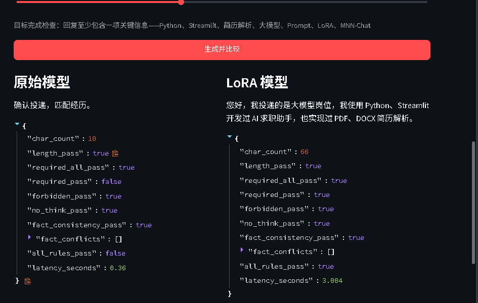
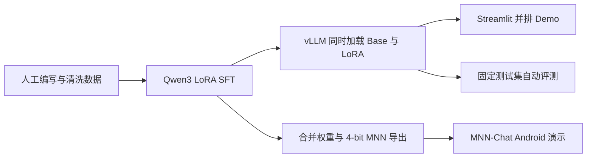

# IM-Reply-Qwen

## 演示视频

[观看或下载 73 秒公开演示](https://github.com/Say1kU/im-reply-qwen/releases/tag/v0.1.0-demo)，内容包括真实的 Base / LoRA 本地推理对比、固定评测结果和项目结构说明。视频无音轨，Release 同时附有中文分镜讲解词。

面向中文即时通信场景的可控回复模型：使用 Qwen3 + LoRA 学习简洁、自然、事实一致的
回复风格，并通过固定测试集比较原始模型与微调模型。

> 当前状态：工程骨架、Profile 数据、规则评测和 Streamlit Demo 已完成；本机 3-step smoke
> training 与 36-step Profile LoRA 训练、Adapter 重载推理均已通过。LoRA Adapter 已发布至
> [ModelScope](https://modelscope.cn/models/Say1kU/im-reply-qwen-lora)，人工盲评尚未完成。
> 仓库不会用离线模板输出冒充模型结果。

基于 96 条招聘沟通样例训练的 Profile LoRA 已完成首轮固定评测：16 条独立样例的规则全通过率
由原始模型的 68.75% 提升到 93.75%。详细设置、逐 checkpoint 结果和限制见
[`reports/profile-eval.md`](reports/profile-eval.md)。



图中两侧使用相同历史对话、目标和可用事实。原始模型没有说明匹配经历，因此目标检查失败；
Profile LoRA 引用了 Python、Streamlit、AI 求职助手和 PDF/DOCX 解析，全部规则通过。

## 为什么做这个项目

通用大模型可以生成回复，但在 IM 场景中经常出现四类问题：回复过长、忽略语气要求、
改写人物/时间/数字、在信息不足时自行承诺。本项目把这些行为定义成可训练、可评测的任务，
而不是只展示一个聊天输入框。



## 已完成

- 统一的场景、历史对话、回复目标、语气和长度控制格式；
- 24 条人工种子训练数据，用于打通流程；
- 10 条与训练样例隔离的规则评测数据；
- 96 条真实技能边界训练样例和 16 条独立招聘评测样例；
- 原始模型与 LoRA Adapter 并排比较的 Streamlit 页面；
- 可用事实输入与“不得编造经历”的提示约束；
- 长度、必要信息、禁用信息、显式事实冲突和思考过程泄漏检查；
- MS-SWIFT LoRA、权重合并和 vLLM LoRA Serving 脚本；
- 单元测试与 GitHub Actions。

本机 smoke test 的真实环境、显存和训练日志摘要见
[`reports/smoke-test.md`](reports/smoke-test.md)。该结果只证明工程链路可运行，不证明模型质量。

## 目录

```text
.
├── app.py                       # Streamlit 对比 Demo
├── data/
│   ├── seed_train.jsonl         # 训练流程种子数据，不是最终数据集
│   └── eval.jsonl               # 固定规则评测集
├── scripts/
│   ├── train_lora.sh            # MS-SWIFT LoRA
│   ├── merge_lora.sh            # 合并 Adapter
│   ├── serve_vllm.sh            # Base + LoRA 同服务
│   ├── run_eval.py              # 批量评测
│   └── validate_data.py         # 数据格式检查
├── src/im_reply_qwen/           # 提示、客户端和评测逻辑
├── tests/
├── MODEL_CARD.md
└── DATA_CARD.md
```

## 1. 先运行离线界面

训练和 vLLM 建议使用 Linux/WSL2。仅运行界面可直接使用 Windows PowerShell：

```powershell
py -3.11 -m venv .venv
.venv\Scripts\Activate.ps1
python -m pip install -r requirements-demo.txt
streamlit run app.py
```

界面默认开启“离线界面演示”。它只用于检查交互，不是模型效果。连接真实 vLLM 服务后应关闭
该开关。

如果本机已经完成 smoke training，侧边栏选择“本地真实模型”即可直接加载 Transformers +
PEFT，不需要启动 vLLM。应用会自动寻找当前工作区内的 Qwen3-0.6B 和最新 LoRA checkpoint；
显示“已找到基础模型和 LoRA checkpoint”后，点击“生成并比较”。第一次加载会比后续生成慢。

## 2. 检查数据和代码

```powershell
$env:PYTHONPATH="src"
python scripts/validate_data.py data/seed_train.jsonl --kind train
python scripts/validate_data.py data/eval.jsonl --kind eval
python -m unittest discover -s tests -v
```

## 3. LoRA 训练

本机为 8GB RTX 4060 Laptop，因此第一轮默认使用 `Qwen/Qwen3-0.6B` 验证完整链路。
公开最终版可在流程稳定后升级到 1.7B，并根据显存使用 QLoRA。

建议在 WSL2 Ubuntu 或云端创建 Python 3.11 环境：

```bash
python3.11 -m venv .venv
source .venv/bin/activate
python -m pip install -U pip
pip install -U ms-swift transformers
bash scripts/train_lora.sh
```

本仓库已经用 `ms-swift==4.5.2` 验证。该版本使用 `--tuner_type lora`；部分旧教程中的
`--train_type lora` 已不再接受。需要完全复现当前环境时，先安装适配显卡的 CUDA PyTorch，
再运行 `pip install -r requirements-train.txt`。

在 Windows PowerShell 的已激活 Python 3.11 环境中也可以运行：

```powershell
# 先用 3 step 验证链路
.\scripts\train_lora.ps1 -MaxSteps 3

# 数据扩展并复核后再运行完整训练
.\scripts\train_lora.ps1
```

24 条 seed 数据只能做 smoke test；本次首轮 Profile LoRA 使用 96 条数据。若要把结果作为
正式产品结论，应继续扩展到 800～1500 条人工复核数据，并把测试集按事件/模板隔离。

可通过环境变量更换模型和输出目录：

```bash
MODEL_ID=Qwen/Qwen3-1.7B \
OUTPUT_DIR=checkpoints/qwen3-17b-im-lora \
bash scripts/train_lora.sh
```

训练完成后，先检查多个 checkpoint 的固定测试集结果，再选择 checkpoint，不要只选训练
Loss 最低的一次。

不启动服务也可以先验证 Adapter 能否重新加载：

```bash
python scripts/local_compare.py \
  --model /path/to/Qwen3-0.6B \
  --adapter /path/to/checkpoint
```

## 4. 同时服务原始模型和 LoRA

vLLM 可以在同一个基座上按模型名切换 LoRA，避免 8GB 显存同时装载两份基座：

```bash
ADAPTER_PATH=checkpoints/qwen3-06b-im-lora/<run>/<checkpoint> \
bash scripts/serve_vllm.sh
```

启动 Demo：

```bash
VLLM_BASE_URL=http://127.0.0.1:8000/v1 \
BASE_MODEL=Qwen/Qwen3-0.6B \
TUNED_MODEL=im-reply-lora \
streamlit run app.py
```

在页面关闭“离线界面演示”，即可看到真实并排结果。

## 5. 固定测试集评测

```bash
python scripts/run_eval.py \
  --base-model Qwen/Qwen3-0.6B \
  --tuned-model im-reply-lora
```

自动规则只能衡量长度和显式约束。最终报告还需要至少 50 条人工盲评，评审者在不知道模型
名称的情况下评价：意图完成、事实一致、语气自然和是否可以直接发送。

建议最终报告对比：

| 版本 | 约束全部通过率 | 事实一致率 | 人工偏好率 | 平均延迟 |
|---|---:|---:|---:|---:|
| 原始模型 + 固定提示 | 68.75% | 100.00% | 待盲评 | 0.801 秒 |
| 原始模型 + Few-shot | 待实测 | 待实测 | 待实测 | 待实测 |
| Profile LoRA checkpoint-36 | 93.75% | 100.00% | 待盲评 | 1.364 秒 |

## 6. MNN 端侧阶段

在 Web Demo 和评测稳定后再进行：

1. 使用 `swift export --merge_lora true` 合并权重；
2. 使用 MNN `llmexport.py --lora_path ... --export mnn --quant_bit 4` 导出；
3. 先用 MNN `llm_demo` 验证固定测试样例；
4. 再导入 MNN-Chat Android，记录首字延迟、解码速度和峰值内存；
5. 发布 60～90 秒真机视频和可复现配置。

参考资料：

- [Qwen3 官方仓库](https://github.com/QwenLM/Qwen3)
- [Qwen3 的 MS-SWIFT 微调说明](https://github.com/QwenLM/Qwen3/blob/main/docs/source/training/ms_swift.md)
- [MNN-LLM 导出说明](https://github.com/alibaba/MNN/blob/master/transformers/README.md)
- [MNN-Chat Android](https://github.com/alibaba/MNN/blob/master/apps/Android/MnnLlmChat/README.md)

## 公开发布检查

- [x] GitHub Actions 通过；
- [x] 数据来源、生成过程、许可证和去隐私方法已写清；
- [x] ModelScope 发布 LoRA Adapter 和模型卡；
- [x] README 填入真实评测数字和失败案例；
- [ ] 在线 Demo 或演示视频可以打开；
- [x] 不提交 Token、私人聊天、简历、手机号和内部数据；
- [ ] MNN 真机结果注明设备型号、系统、量化位数和运行参数。

## 许可证

代码使用 MIT License。数据和模型权重需要遵循各自的数据许可证及 Qwen 基座模型许可证；
发布 Adapter 前请再次核对所用具体模型的 Model Card。
